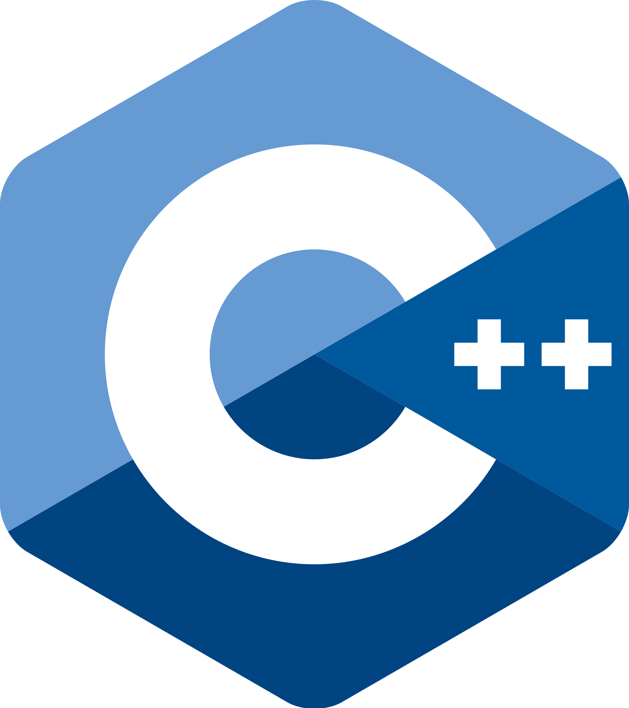
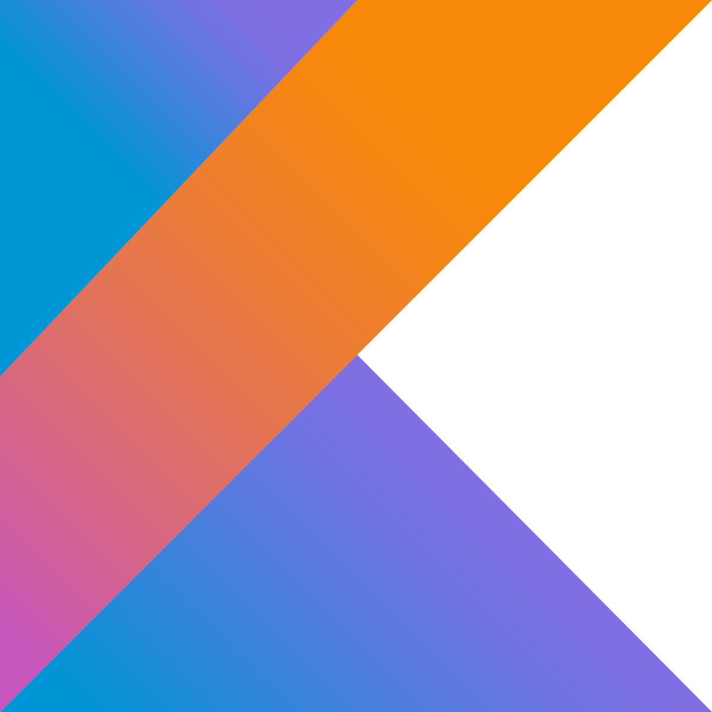
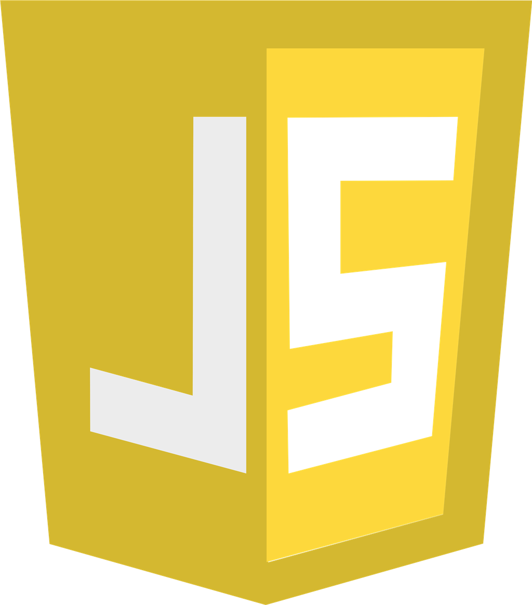

## Hi👋, My name is Danzz (Ramdani)
I'm a programmer, my role is Full Stack Web Developer (Frontend+Backend) from Bogor, West Java, Indonesian, I am 17 years old, thanks.

## 🚀 Programming Languages
<a href="https://danzzcoding.my.id" style="text-decoration: none">
  

    
    
    
    
    
    
    
    
    
    
    
    
  

</a>

### Markup Languages
<a href="https://danzzcoding.my.id" style="text-decoration: none">
  

    
  

</a>

### Styling Languages
<a href="https://danzzcoding.my.id" style="text-decoration: none">
  

    
  

</a>

## ⚒ Tools & Framework
<a href="https://danzzcoding.my.id" style="text-decoration: none">
  

    
    
    
  

</a>

## 📉 My GitHub Stats

<a href="https://danzzcoding.my.id" style="text-decoration:none">
  

    
    
  

</a>

## 🔗 Get in touch with me

  
  
  
  

